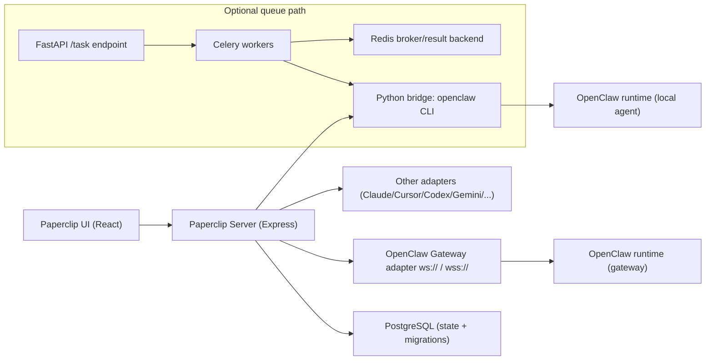

# Zero-Human Multiagents (Paperclip + OpenClaw)

This repository is a multi-agent automation platform built by combining:

- **Paperclip Orchestrator** (`orchestrator/`) for company/project/task orchestration
- **Zero-Human execution logic** (`backend-logic/`) for scripted OpenClaw bridge flows
- **Optional async task API** (`backend-api/`) using FastAPI + Celery + Redis

In short: Paperclip manages the business process; Zero-Human runs the deep execution workflow.

---

## Table of contents

- [1) What this project does](#1-what-this-project-does)
- [2) Repository structure](#2-repository-structure)
- [3) Core features](#3-core-features)
- [4) System wiring (how components connect)](#4-system-wiring-how-components-connect)
- [5) OpenClaw: install, connection to Paperclip, how it works](#5-openclaw-install-connection-to-paperclip-how-it-works)
- [6) Installation and setup](#6-installation-and-setup)
- [7) Running the system](#7-running-the-system)
- [8) End-to-end process flow](#8-end-to-end-process-flow)
- [9) API and queue integration (optional)](#9-api-and-queue-integration-optional)
- [10) Operations and deployment scripts](#10-operations-and-deployment-scripts)
- [11) Troubleshooting guide](#11-troubleshooting-guide)
- [12) Security notes](#12-security-notes)
- [13) Developer commands reference](#13-developer-commands-reference)
- [14) Key documents to read next](#14-key-documents-to-read-next)
- [15) License](#15-license)
- [16) Production readiness snapshot](#16-production-readiness-snapshot)
- [17) Organization rollout checklist](#17-organization-rollout-checklist)
- [18) Known gaps and recommendations](#18-known-gaps-and-recommendations)

---

## 1) What this project does

This project lets you run an AI-agent team against real work from a dashboard:

- Create companies, projects, goals, issues, and routines in a UI
- Assign tasks to agents with role hierarchy
- Route execution into adapter agents (OpenClaw, Claude, Cursor, Codex, Gemini, etc.)
- Use a Python cascade bridge to enforce structured multi-step delivery (plan, build, review, deploy)
- Track status/cost/activity with persistent logs and database-backed state

---

## 2) Repository structure

- `orchestrator/`
  - Main app (Node.js + TypeScript + React)
  - `server/`: Express API and orchestration backend
  - `ui/`: Vite + React frontend
  - `packages/db/`: schema and migrations
  - `packages/adapters/`: local adapters (`openclaw-gateway`, `claude-local`, `codex-local`, etc.)
  - `packages/plugins/`: plugin SDK and examples
- `backend-logic/`
  - Python bridge scripts, shell ops scripts, webhook helpers, SQL snippets, architecture docs
  - Main bridge: `backend-logic/scripts/Python_Bridges/openclaw_bridge_cascade.py`
- `backend-api/`
  - Optional FastAPI service that queues heavy tasks into Celery workers
  - Files: `main.py`, `celery_app.py`, `tasks.py`, `Dockerfile`

---

## 3) Core features

- **Multi-agent orchestration:** manage many agent types through one control plane
- **Task and goal hierarchy:** issues map upward to projects and business goals
- **Agent role sequencing:** architect/developer/reviewer/deployer style execution cascade
- **Heartbeat/routine model:** scheduled background progress checks and recurring work
- **Governance controls:** approvals, mutation guards, scoped actors, auth-aware flows
- **Plugin architecture:** plugin registry, worker manager, job scheduler, tool dispatcher
- **Cost and activity visibility:** dedicated routes and activity pipeline in orchestrator backend

### 3.1 Feature deep dive (Telegram, multi-model, dynamic env)

#### A) Telegram notifications (implemented)

Telegram is implemented as a first-class notification channel in the orchestrator backend.

- Channel provider: `telegram`
- Token handling: bot token is stored as an encrypted secret (`tokenSecretId`), not plain text
- Destination handling: per-channel `chatId` stored in channel settings
- Delivery API: backend sends to `https://api.telegram.org/bot<TOKEN>/sendMessage`
- Reliability: retry logic with exponential backoff/jitter for retryable failures
- Event mapping: default mappings include events like `agent_failed`, `agent_timed_out`, `agent_recovered`

Implementation references:

- `orchestrator/server/src/services/channels.ts` (channel CRUD, token secret creation, mappings)
- `orchestrator/server/src/services/notifications.ts` (Telegram sender + retries + delivery logs)

Current status:

- ✅ Telegram is implemented
- ⚠️ Slack/WhatsApp providers exist as stubs and are not implemented yet

#### B) Multi-model + provider routing (OpenAI/vLLM style)

The project supports model/provider configuration at company level, with role-aware routing patterns.

What exists today:

- Company settings UI has managed fields like `MODEL`, `OPENAI_API_KEY`, `GITHUB_TOKEN`, `GH_TOKEN`, `REPO_LINK`
- Advanced LLM settings draft includes:
  - `default_provider`
  - `default_model`
  - provider blocks (for example `vllm_openai_compatible` with `base_url`)
  - per-role model overrides (`architect`, `grunt`, `pedant`, `scribe`)

Bridge/model resolution behavior (important):

- In cascade bridge, `MODEL` from company settings can map to `OPENCLAW_MODEL` **when `OPENCLAW_MODEL` is not already set**
- If role/company LLM settings provide model/provider/api key, those can override runtime target model/key
- Fallback stays backward compatible with env-driven defaults (for example `OPENCLAW_MODEL` and `OPENAI_API_KEY`)

Implementation references:

- `orchestrator/ui/src/pages/CompanySettings.tsx` (managed env + advanced LLM settings UI state)
- `backend-logic/scripts/Python_Bridges/openclaw_bridge_cascade.py` (target model/provider/key resolution and OpenClaw invocation)
- `backend-logic/docs/VLLM_DYNAMIC_MULTI_AGENT_IMPLEMENTATION_PLAN.md` (target architecture and precedence)

#### C) Dynamic environment variables (how they actually work)

This stack is designed so runtime values can be injected per run/company, not hardcoded globally.

Key behavior:

1. **Paperclip heartbeat/service layer** tracks a managed set of env keys:
   - `OPENAI_API_KEY`, `GITHUB_TOKEN`, `GH_TOKEN`, `MODEL`, `REPO_LINK`
2. **Company settings** can update these values centrally.
3. **Runtime execution** receives injected context/env (including Paperclip IDs and auth context).
4. **Bridge loader** reads `backend-logic/.env`, but does not blindly overwrite already-set process values.
5. **Precedence effect**: run-injected values can win over static `.env`, while preserving backward compatibility.

Why this matters:

- You can change repo/model/token behavior per company or run without rebuilding code.
- Celery/heartbeat-triggered executions can carry per-run identity (`PAPERCLIP_AGENT_ID`) safely.
- Existing legacy `.env` setups still work as fallback.

Implementation references:

- `orchestrator/server/src/services/heartbeat.ts` (`PROCESS_MANAGED_ENV_KEYS`, runtime orchestration)
- `backend-logic/scripts/Python_Bridges/openclaw_bridge_cascade.py` (`load_env`, `MODEL`→`OPENCLAW_MODEL`, runtime overrides)

---

## 4) System wiring (how components connect)



### Backend route wiring (orchestrator server)

The main server app wires route modules for:

- health
- companies, company skills, agents, projects, issues, routines
- execution workspaces, goals, approvals, secrets, costs, activity
- dashboard/sidebar badges/channels/instance settings
- LLM and company LLM settings
- plugins and plugin static UI

These are assembled in `orchestrator/server/src/app.ts`.

### Queue wiring (optional backend-api)

- `POST /task` receives task payload (`issue_id`, `repo_url`, `user_id`, `metadata`)
- API enqueues `execute_agent_task` via Celery
- Worker imports and runs `openclaw_bridge_cascade` logic
- `GET /status/{task_id}` returns current state and result/error

---

## 5) OpenClaw: install, connection to Paperclip, how it works

**OpenClaw** is the agent *runtime* (CLI + gateway): it runs `openclaw agent …`, uses tools, and writes session data under `~/.openclaw`. **Paperclip** is the *orchestrator*: it stores companies, issues, and agent configs, and drives work through adapters. They complement each other: Paperclip decides *what* runs and *when*; OpenClaw performs the interactive agent execution.

This repository wires OpenClaw in **two different ways**. Both can exist on the same deployment, but they are not the same code path.

### 5.1 Path A — Paperclip UI ↔ OpenClaw **Gateway** (dashboard agents)

Paperclip integrates with OpenClaw only through the **`openclaw_gateway` adapter** (WebSocket). The legacy HTTP `openclaw` adapter is not supported here.

| Step | What happens |
|------|----------------|
| 1 | You run **Paperclip** (`pnpm dev` in `orchestrator/`, or production). |
| 2 | You run an **OpenClaw** environment that exposes a **gateway** WebSocket (`ws://` or `wss://`). For local smoke tests, the repo includes scripts under `orchestrator/scripts/smoke/` (e.g. `openclaw-docker-ui.sh`). |
| 3 | In the **Paperclip UI** (Company Settings), you use **Generate OpenClaw Invite Prompt**, paste the prompt into OpenClaw’s chat, then **approve the join** in Paperclip. |
| 4 | Paperclip stores an **agent** whose `adapterType` is `openclaw_gateway`, with `adapterConfig` containing the gateway **URL**, **token** (e.g. `headers["x-openclaw-token"]`), and often a persisted **`devicePrivateKeyPem`** for device auth. |
| 5 | When that agent receives a task, **`@paperclipai/adapter-openclaw-gateway`** connects over WebSocket: `connect` challenge → `req agent` → `agent.wait` → streams `event agent` frames into Paperclip logs/transcripts. |

Auth and transport details (tokens, optional `disableDeviceAuth`, session key strategies) are documented in:

- [`orchestrator/packages/adapters/openclaw-gateway/README.md`](orchestrator/packages/adapters/openclaw-gateway/README.md)

End-to-end onboarding commands (health checks, Docker OpenClaw, invite flow) are in:

- [`orchestrator/doc/OPENCLAW_ONBOARDING.md`](orchestrator/doc/OPENCLAW_ONBOARDING.md)

**Install / run OpenClaw for this path (abbreviated):**

1. Start Paperclip and verify `/api/health` (see onboarding doc for flags like `pnpm dev --tailscale-auth` when needed).
2. Start a clean OpenClaw stack for testing, for example from `orchestrator/`:

   ```bash
   OPENCLAW_RESET_STATE=1 OPENCLAW_BUILD=1 ./scripts/smoke/openclaw-docker-ui.sh
   ```

3. Follow **OPENCLAW_ONBOARDING.md** for invite prompt, approval, and preflight checks (`adapterType`, `ws://` URL, token length, device key).

### 5.2 Path B — Zero-Human Python bridge ↔ OpenClaw **CLI** (cascade on the host)

The file [`backend-logic/scripts/Python_Bridges/openclaw_bridge_cascade.py`](backend-logic/scripts/Python_Bridges/openclaw_bridge_cascade.py) runs the **multi-role cascade** (e.g. Architect → Grunt → Pedant → Scribe) by **shelling out** to the OpenClaw CLI, roughly:

`/usr/bin/openclaw agent --agent main -m "<built prompt>"`

So for this path you need a real **`openclaw` binary** on the machine that runs the bridge (Celery worker or manual process), at the path your environment uses (the script targets `/usr/bin/openclaw`).

**How it connects to Paperclip:** the bridge reads Paperclip/issue context from the environment and database (as implemented in the script—issue id, assignee, API calls, etc.) and uses `.env` from `backend-logic/` for keys and `OPENCLAW_MODEL`. It does **not** use the WebSocket gateway adapter; it drives OpenClaw **locally** like an operator in a terminal.

**Install hints for Path B:**

1. Install OpenClaw so `openclaw` is available; align with **`/usr/bin/openclaw`** or adjust your deployment to match what the script invokes.
2. **Node on PATH:** OpenClaw is invoked via `#!/usr/bin/env node`. The bridge includes `prefer_system_node_in_path()` so a bundled IDE Node does not shadow the system Node and break OpenClaw’s version checks—keep OS Node where OpenClaw expects it.
3. Copy/configure **`backend-logic/.env`**: `OPENAI_API_KEY`, `GITHUB_TOKEN`, `OPENCLAW_MODEL`, etc. (see [`backend-logic/README.md`](backend-logic/README.md)).
4. Optional: [`backend-logic/scripts/Shell_Execution/setup.sh`](backend-logic/scripts/Shell_Execution/setup.sh) writes `~/.openclaw/agents/main/agent/auth-profiles.json` from `OPENAI_API_KEY` and runs `openclaw models` for a quick sanity check.

### 5.3 How the two paths relate

| | Gateway (Path A) | CLI bridge (Path B) |
|---|------------------|---------------------|
| **Entry** | Paperclip server → adapter package | Python script / Celery → `subprocess` |
| **OpenClaw** | Remote/local **gateway** WebSocket | **CLI** `openclaw agent` |
| **Typical use** | Agents configured in the UI, heartbeats, normal Paperclip tasks | Scripted cascade, heavy automation, Zero-Human ops |
| **Docs** | `OPENCLAW_ONBOARDING.md`, `openclaw-gateway/README.md` | `backend-logic/README.md`, architecture manual |

Both paths rely on a correctly installed OpenClaw ecosystem and credentials; only the **integration mechanism** differs (WebSocket adapter vs local CLI).

---

## 6) Installation and setup

## 6.1 Prerequisites

- Node.js **20+**
- pnpm **9.15+**
- Python **3.11+** recommended
- Redis (if using Celery path)
- PostgreSQL (Paperclip manages DB setup/migrations; see orchestrator docs for modes)

## 6.2 Clone and bootstrap

```bash
git clone <your-repo-url>
cd paperclipuimodifi
```

### Orchestrator install

```bash
cd orchestrator
pnpm install
```

### Optional Python environments

For `backend-api`:

```bash
cd ../backend-api
python3 -m venv .venv
source .venv/bin/activate
pip install -r requirements.txt
```

For `backend-logic` webhook utilities:

```bash
cd ../backend-logic/scripts/Webhooks
python3 -m venv .venv
source .venv/bin/activate
pip install -r requirements.txt
```

---

## 7) Running the system

## 7.1 Main app (recommended)

```bash
cd orchestrator
pnpm dev
```

Useful alternatives:

- `pnpm dev:once` -> run full stack without watcher restarts
- `pnpm dev:server` -> backend only
- `pnpm dev:ui` -> frontend only

## 7.2 Database operations

```bash
cd orchestrator
pnpm db:generate
pnpm db:migrate
```

## 7.3 Optional backend-api + Celery

Terminal 1 (API):

```bash
cd backend-api
uvicorn main:app --host 0.0.0.0 --port 8100 --reload
```

Terminal 2 (worker):

```bash
cd backend-api
celery -A celery_app.celery_app worker --loglevel=info
```

Ensure Redis is running, or set:

- `CELERY_BROKER_URL`
- `CELERY_RESULT_BACKEND`

Defaults are `redis://localhost:6379/0`.

---

## 8) End-to-end process flow

1. Open Paperclip UI and create a task/issue.
2. Issue is persisted by orchestrator backend and visible in dashboards/activity.
3. Assigned adapter/bridge path is resolved: **OpenClaw Gateway agents** run through the WebSocket adapter; **Zero-Human** may run the **Python cascade** (CLI OpenClaw) via workers or manual execution.
4. The cascade bridge (when used) executes sequenced agent phases with `openclaw agent`.
5. Outputs/logs/status are written back through the orchestration layer.
6. Optional queue path can offload heavy execution to Celery workers.

---

## 9) API and queue integration (optional)

`backend-api/main.py` endpoints:

- `GET /health` -> service health
- `POST /task` -> enqueue heavy task
- `GET /status/{task_id}` -> poll Celery state/result

Example request:

```bash
curl -X POST http://localhost:8100/task \
  -H "Content-Type: application/json" \
  -d '{
    "issue_id":"issue-123",
    "repo_url":"https://github.com/your-org/your-repo.git",
    "user_id":"u-001",
    "metadata":{"PAPERCLIP_AGENT_ID":"agent-abc"}
  }'
```

---

## 10) Operations and deployment scripts

Important scripts in `backend-logic/scripts/`:

- `Python_Bridges/openclaw_bridge_cascade.py` -> primary bridge entry point
- `sync_to_remote.sh` -> rsync local workspace to remote host (manual or watch mode)
- `Shell_Execution/restart_dashboard.sh` -> restarts remote Paperclip process and reloads env
- `Shell_Execution/setup.sh` -> OpenClaw auth profile bootstrap

These are designed for remote deployment workflows (for example, cloud VM / RunPod-style hosts).

---

## 11) Troubleshooting guide

- **Server starts but task flow stalls**
  - Check orchestrator logs and confirm issue assignment/agent IDs.
  - Verify bridge import paths and env variables.
- **Migrations block startup**
  - Run `pnpm db:migrate` inside `orchestrator/`.
  - Confirm DB URL is correct and reachable.
- **Celery task stuck in PENDING**
  - Ensure Redis is running.
  - Ensure worker process is active and using same broker URL as API.
- **Token/auth related failures**
  - Re-check `.env` values and process reloads.
  - Avoid stale daemon env by restarting long-running services.
- **Remote sync not updating**
  - Check `.env` values used by `sync_to_remote.sh` (host/user/port/key path/remote dir).
- **OpenClaw Gateway agent (UI path)**
  - Confirm agent `adapterType` is `openclaw_gateway` and URL is `ws://` or `wss://` (not legacy HTTP adapter).
  - Confirm gateway token is present and non-trivial; see `OPENCLAW_ONBOARDING.md` preflight.
  - If you see **pairing required**, approve the device in OpenClaw (separate from Paperclip invite approval); then retry the task.
- **OpenClaw CLI / Python bridge (cascade path)**
  - Confirm `/usr/bin/openclaw` exists (or align install path with what the script invokes).
  - If OpenClaw fails Node version checks, fix PATH so system Node wins over IDE-bundled Node (see `prefer_system_node_in_path` in `openclaw_bridge_cascade.py`).
  - Verify `backend-logic/.env` and that the process was restarted after changes.

---

## 12) Security notes

- Do not commit real secrets (`.env` is ignored by repo settings).
- Use least-privilege tokens wherever possible.
- Treat shell scripts that export env vars as sensitive operational code.
- Review remote restart scripts before production use (some include force-kill behavior).

---

## 13) Developer commands reference

From `orchestrator/`:

- `pnpm dev`
- `pnpm dev:watch`
- `pnpm dev:once`
- `pnpm dev:server`
- `pnpm dev:ui`
- `pnpm build`
- `pnpm typecheck`
- `pnpm test`
- `pnpm test:run`
- `pnpm db:generate`
- `pnpm db:migrate`

Also available:

- E2E and release smoke tests via Playwright (`test:e2e`, `test:release-smoke`)
- docs local preview (`docs:dev`)

---

## 14) Key documents to read next

- `orchestrator/README.md`
- `orchestrator/doc/DEVELOPING.md`
- `orchestrator/doc/OPENCLAW_ONBOARDING.md`
- `orchestrator/packages/adapters/openclaw-gateway/README.md`
- `orchestrator/packages/adapters/openclaw-gateway/doc/ONBOARDING_AND_TEST_PLAN.md`
- `backend-logic/README.md`
- `backend-logic/docs/ZERO_HUMAN_ARCHITECTURE_AND_OPERATIONS.md`
- `backend-logic/docs/VLLM_DYNAMIC_MULTI_AGENT_IMPLEMENTATION_PLAN.md`
- `backend-logic/docs/TELEGRAM_CHANNELS_IMPLEMENTATION_PLAN.md`

---

## 15) License

`orchestrator/` is MIT-licensed under `orchestrator/LICENSE` (upstream Paperclip license).
For any project-specific additions in other directories, verify headers and organization policy.

---

## 16) Production readiness snapshot

This section is a practical readiness view for organization-level sharing.

| Area | Status | Notes |
|---|---|---|
| Core orchestration (`orchestrator/`) | ✅ Usable | Full server/UI/DB pipeline, adapters, and task lifecycle are implemented. |
| OpenClaw Gateway onboarding | ✅ Usable | Gateway adapter + onboarding flow documented and tested via smoke scripts/docs. |
| Python cascade bridge (`backend-logic`) | ✅ Usable with ops discipline | Powerful path for multi-role execution; requires strict env/runtime control. |
| Telegram notifications | ✅ Implemented | Tokenized, encrypted secret storage and delivery retry logic are implemented. |
| Multi-model role routing | 🟡 Partially implemented | Base plumbing exists; dynamic/provider-first architecture is in active plan docs. |
| Slack/WhatsApp notifications | ❌ Not implemented | Provider stubs exist; currently Telegram is the implemented notification channel. |
| Optional FastAPI/Celery sidecar | 🟡 Optional | Works for queued execution but adds infra/ops overhead (Redis + worker lifecycle). |

**Recommended organization posture today**

- Treat this platform as **production-capable for controlled teams**, with explicit runbooks and owner assignment.
- Keep OpenClaw onboarding and env management as a **gated operational process** (not ad hoc).
- Enable one integration at a time (Gateway first, then cascade automation, then optional queue sidecar).

---

## 17) Organization rollout checklist

Use this checklist before broad internal distribution.

### A) Ownership and governance

- Assign named owners for:
  - Platform runtime (`orchestrator`)
  - Agent/runtime integration (OpenClaw)
  - Security/secrets and access control
  - On-call/incident response
- Define branch protection and PR requirements on target repositories used by agents.
- Define approval policy for high-risk operations (deploy scripts, token rotation, production writes).

### B) Security and secrets

- Verify no secrets are committed (`.env`, token files, key material).
- Standardize token sources (`OPENAI_API_KEY`, `GITHUB_TOKEN`, `GH_TOKEN`) and rotation cadence.
- Confirm secret storage strategy for channels and adapters (encrypted-at-rest where supported).
- Review remote scripts that perform forceful process management before production use.

### C) Environment and infra

- Lock runtime versions (Node, pnpm, Python, Redis, Postgres) in deployment docs.
- Validate OpenClaw binary/runtime path expectations (`/usr/bin/openclaw` for bridge path).
- Confirm health checks and startup behavior:
  - API: `/api/health`
  - Queue sidecar (if used): FastAPI `/health`, Celery worker process, Redis connectivity
- Confirm migration flow (`pnpm db:migrate`) in CI/CD or deployment runbooks.

### D) Functional verification (minimum)

- Run OpenClaw gateway onboarding checklist (`orchestrator/doc/OPENCLAW_ONBOARDING.md`).
- Execute at least one issue through each intended production path:
  - Gateway adapter path
  - Python cascade path (if enabled)
  - Celery sidecar path (if enabled)
- Verify Telegram notification send/test for one company.
- Verify model/env overrides from Company Settings are reflected in runtime behavior.

### E) Observability and operations

- Ensure logs are centralized and searchable for:
  - heartbeat runs
  - adapter execution failures
  - notification delivery failures
- Define alert thresholds for:
  - repeated task failures/timeouts
  - queue backlog growth (if Celery enabled)
  - DB migration/startup failures
- Create incident runbook links and escalation contacts in internal docs/wiki.

---

## 18) Known gaps and recommendations

### Current gaps

- Notification providers beyond Telegram are not implemented yet.
- Multi-model/provider routing is evolving; advanced dynamic behavior is documented but not fully unified across all paths.
- Some operations scripts are environment-specific and may include aggressive process handling unsuitable for all orgs.
- Documentation spans multiple subfolders; one canonical internal runbook may still be needed for your org.

### Recommended next improvements

1. **Create an internal “golden path” runbook** for your org (single deployment model, single onboarding flow).
2. **Pin and validate runtime versions** in CI plus preflight scripts.
3. **Implement provider readiness checks** at startup (OpenClaw reachable, Telegram token validity, DB migration state).
4. **Complete non-Telegram channel providers** or hide unimplemented options from production UI.
5. **Finalize role-based model policy** (default model + per-role overrides + clear precedence matrix).
6. **Add a one-command smoke test** for your exact production topology.
