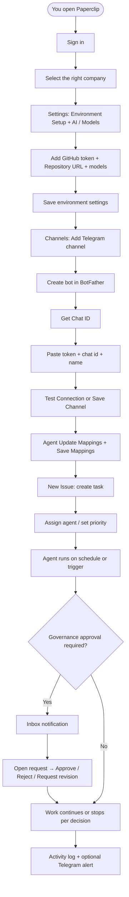
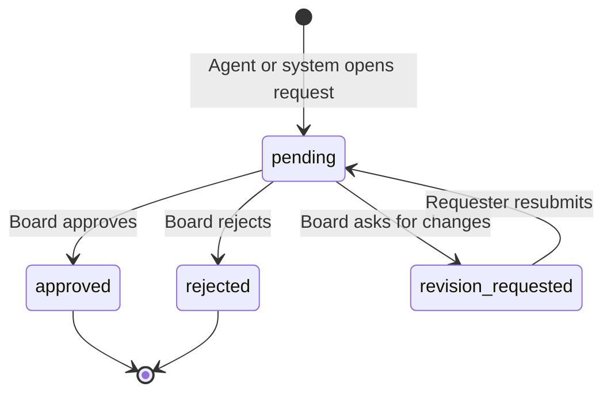
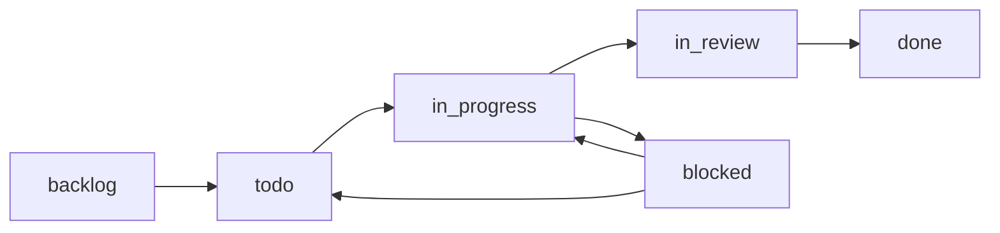

# Paperclip — Complete user guide (A to Z)

This guide is written for **people who are not software developers**. You can follow it from top to bottom to set up your company, connect **Telegram** alerts, configure **GitHub** and **models**, create **issues** (tasks), and handle **approvals** through to completion.

**Example address:** your team might give you a link like [http://54.198.208.79:3301/PAP/dashboard](http://54.198.208.79:3301/PAP/dashboard). In that example, `PAP` is the **company code**; your real link may look different but will behave the same way.

---

## Table of contents

1. [What Paperclip does (in one minute)](#1-what-paperclip-does-in-one-minute)  
2. [Before you start: open the app and pick your company](#2-before-you-start-open-the-app-and-pick-your-company)  
3. [Part A — GitHub: create a token](#3-part-a--github-create-a-token)  
4. [Part B — GitHub: copy your repository link](#4-part-b--github-copy-your-repository-link)  
5. [Part C — Models: what to set and where](#5-part-c--models-what-to-set-and-where)  
6. [Part D — Telegram (highlighted): bot, chat ID, connect in Paperclip](#6-part-d--telegram-highlighted-bot-chat-id-connect-in-paperclip)  
7. [Part E — Company Settings: paste everything and save](#7-part-e--company-settings-paste-everything-and-save)  
8. [Part F — Create an issue (task) step by step](#8-part-f--create-an-issue-task-step-by-step)  
9. [Part G — When something needs your approval (use Inbox)](#9-part-g--when-something-needs-your-approval-use-inbox)  
10. [Part H — After you approve: what happens next](#10-part-h--after-you-approve-what-happens-next)  
11. [Flow charts — how it all fits together](#11-flow-charts--how-it-all-fits-together)  
12. [Glossary and quick troubleshooting](#12-glossary-and-quick-troubleshooting)  

---

## 1. What Paperclip does (in one minute)

Paperclip is a **control room** for AI agents that work like team members. You define **where the code lives (GitHub)**, **which AI models to use**, and **who gets alerted (Telegram)**. You create **issues** (tasks). Agents pick up work, run in short **sessions**, and update the task. Some big decisions need a human **yes/no**; the usual place you see that is **Inbox** (notifications), not a separate menu item called “Approvals.” **Telegram** is the main built-in way to get **instant alerts** when agents fail, recover, time out, or succeed (if you turn those on).

---

## 2. Before you start: open the app and pick your company

1. Open the **URL** your administrator sent you (for example [http://54.198.208.79:3301/PAP/dashboard](http://54.198.208.79:3301/PAP/dashboard)).  
2. **Sign in** using the method your organization uses (email, invite link, or other). If you see “setup required,” only an **administrator** can finish first-time setup—ask them.  
3. If you have more than one **company**, select the correct one from the **company strip** on the side of the screen. The **company name** at the top of the menu should match the team you are configuring.

Everything below (Settings, Channels, Issues) applies to the **currently selected company**.

---

## 3. Part A — GitHub: create a token

Agents need permission to **read your repository**, **push branches**, and **open pull requests**. GitHub controls that permission with a **personal access token** (a long secret string). Paperclip asks for the same token in **two** fields (`GITHUB_TOKEN` and `GH_TOKEN`) so different tools all authenticate—**paste the same token into both**.

### Option 1 — Classic token (often simplest)

1. In a browser, go to [https://github.com](https://github.com) and sign in to the account that **owns or can administer** the repository.  
2. Click your **profile picture** (top right) → **Settings**.  
3. Scroll the left sidebar to the bottom → **Developer settings**.  
4. Click **Personal access tokens** → **Tokens (classic)**.  
5. Click **Generate new token (classic)**.  
6. Give it a **Note** you will recognize later (for example `Paperclip company PAP`).  
7. Choose an **Expiration** your security policy allows (shorter is safer).  
8. Under **scopes**, enable **`repo`** (this includes access to private repositories and pull requests). If your admin asks for it, also enable **`workflow`** for GitHub Actions–related automation.  
9. Click **Generate token**.  
10. **Copy the token immediately** and store it in a password manager. GitHub will not show it again. It usually starts with `ghp_`.

### Option 2 — Fine-grained token (stricter, per-repository)

1. GitHub → **Settings** → **Developer settings** → **Personal access tokens** → **Fine-grained tokens** → **Generate new token**.  
2. Choose the **resource owner** (user or organization) and **only the repositories** Paperclip should touch.  
3. Under **Repository permissions**, set at least:  
   - **Contents**: Read and write (so branches and files can be updated)  
   - **Metadata**: Read-only (usually automatic)  
   - **Pull requests**: Read and write (so agents can open PRs)  
4. Generate the token and **copy** it once.

### Safety rules (plain language)

- Treat the token like a **password**. Do not paste it in public chats or email.  
- If a token leaks, **revoke** it in GitHub and create a new one, then update Paperclip **Settings**.

---

## 4. Part B — GitHub: copy your repository link

The **repository URL** is the normal **HTTPS** address of your project on GitHub.

1. Open your repository in the browser (for example `https://github.com/your-org/your-repo`).  
2. Click the green **Code** button.  
3. Select **HTTPS** if it is not already selected.  
4. Click **copy**. You should get a link like `https://github.com/your-org/your-repo.git` or without `.git`—**either form is usually fine** as long as it is the full web address of the repo.  
5. In Paperclip, this value goes in **Settings → Environment Setup → Repository URL** (labeled **Repository URL** / `REPO_LINK` in the product).

**Tip:** The GitHub account that owns the **token** must have access to **this exact repository**.

---

## 5. Part C — Models: what to set and where

“Model” means **which AI brain** answers when an agent runs. Paperclip gives you **two layers**; you can start simple and add detail later.

### Layer 1 — **Environment Setup → AI Model** (simple default)

- Path: **Settings** (side menu, under Company) → section **Environment Setup** → field **AI Model**.  
- Here you type a **model name** your organization uses globally as a default (examples your admin might give: `openai/gpt-4o`, `openai/gpt-5`, or another approved name).  
- Leave it blank if your admin says the default is controlled only on the server.

### Layer 2 — **AI / Models** (provider, URL, per-role)

Still on **Settings**, open the **AI / Models** section. This is for teams that use **OpenAI**, **self-hosted**, or **OpenAI-compatible** servers (sometimes called vLLM-style endpoints).

| Control | Plain meaning |
|--------|----------------|
| **Execution mode** | **`always_proceed`** means agents can start work without an extra human click each time. **`ask_before_proceed`** means the system should ask a person before certain runs—your admin sets how wide that gate is (**Ask scope**). |
| **Provider** | Which vendor or engine speaks to the model. |
| **Base URL** | The web address of the model server (often used for **private** or **in-house** AI). Your admin will supply it if needed. |
| **API Key** (under provider) | The key for **that provider**, not necessarily the same as GitHub. |
| **Default model** | The model name used when no role-specific override exists. |
| **Per-role model mapping** | Different job types (**Architect**, **Grunt**, **Pedant**, **Scribe**) can each use a different model or provider if your admin configures it. |

**OpenAI API Key** in **Environment Setup** is separate: it is the key many stacks use for cloud OpenAI-style calls. Your administrator decides whether you rely on **Environment Setup** only, **AI / Models** only, or **both**.

After any change, use **Save** on those sections. If your admin enabled **Sync these environment keys to existing agents**, leave it **on** when saving **Environment Setup** so current agents pick up new secrets.

---

## 6. Part D — Telegram (highlighted): bot, chat ID, connect in Paperclip

**Telegram is the main notification channel in Paperclip today.** Other channel names may appear in the product roadmap, but **connecting a Telegram bot is what this screen is built for.**

You need **three things**: a **bot token** from Telegram, the **numeric chat ID** where messages should go, and a **name** you recognize inside Paperclip.

### Step 1 — Create a bot with BotFather (get the token)

1. Install **Telegram** on your phone or computer and sign in.  
2. Open a chat with **[@BotFather](https://t.me/BotFather)** (official Telegram account).  
3. Send the command `/newbot`.  
4. Follow the prompts: choose a **display name** and a **username** that must end in `bot` (for example `MyCompanyAlertsBot`).  
5. BotFather replies with a **HTTP API token**. It looks like `123456789:AA...` (digits, colon, long random letters). **Copy it**—this is what Paperclip calls **Telegram Bot Token**.  
6. Optional: send `/setjoingroups` to BotFather and pick your bot if you want it to **receive group messages** (needed for some group setups). Follow BotFather’s prompts.

**Security:** The token is a **password** for your bot. Anyone with it can send messages as the bot. Paperclip **encrypts** it when stored and does not show the full token again after save.

### Step 2 — Get your **Chat ID** (where alerts are delivered)

You must use a **numeric** ID (may be negative for groups/supergroups).

**Private chat (only you):**

1. Open Telegram, search for **[@userinfobot](https://t.me/userinfobot)** or **[@RawDataBot](https://t.me/RawDataBot)** (third-party bots that show your ID).  
2. Start the bot and send any message; it replies with **your user id** (a number). That number is your **Chat ID** for direct messages.

**Group or channel (team alerts):**

1. Add your **new bot** to the **group** (or link it to the channel per Telegram’s channel rules).  
2. Send a short message in the group **mentioning the bot** or sending a normal message after the bot joined.  
3. Use a bot such as **[@getidsbot](https://t.me/getidsbot)** **inside that same group**, or ask your admin to read the chat id from Telegram’s tools. Supergroup IDs often look like **`-100` followed by more digits** (example pattern: `-1001234567890`).  
4. Copy that **numeric** value into Paperclip as **Telegram Chat ID**.

If **Test Connection** fails, the most common causes are: wrong chat id, bot not added to the group, or the bot blocked by privacy settings in groups.

### Step 3 — Connect inside Paperclip (**Channels**)

1. In Paperclip, open **Channels** from the side menu (under **Company**).  
2. Click **Add Channel**. The dialog title is **Add Telegram Channel**.  
3. Fill in:  
   - **Channel Name** — at least 3 characters (for example `Ops Alerts`).  
   - **Telegram Bot Token** — paste from BotFather.  
   - **Telegram Chat ID** — paste the numeric id.  
   - **Enabled** — leave on so events can be delivered.  
4. Click **Test Connection** to send a test without saving, or **Save Channel** to store it. After save, the token is **masked** in the list.  
5. On the saved channel card, use **Test** anytime to confirm Telegram still receives messages.

### Step 4 — Choose **which events** go to Telegram

Each saved channel has **Agent Update Mappings** (the same names appear in the app):

| Event label | When you usually want it |
|-------------|---------------------------|
| **Agent failed** | On — you want an alert when a run crashes or errors. |
| **Agent timed out** | On — the run took too long. |
| **Agent recovered** | On — informational “back to healthy.” |
| **Agent succeeded** | Optional — on busy teams this can be noisy; many people leave it off unless they want a positive confirmation for every success. |

For each row you can set **severity** (Critical / Warning / Info) and whether it is **Enabled**. Click **Save Mappings** when you are done.

**Delivery status** on the card shows whether the last message reached Telegram. Failed rows show an error hint you can forward to your admin.

---

## 7. Part E — Company Settings: paste everything and save

1. Side menu → **Settings** (under Company).  
2. **Environment Setup**  
   - Paste **OpenAI API Key** if your process uses it.  
   - Paste the **same GitHub token** into **GitHub Token (GITHUB_TOKEN)** and **GitHub Token (GH_TOKEN)**.  
   - Optionally set **AI Model**.  
   - Paste **Repository URL**.  
   - Turn **Sync these environment keys to existing agents** **on** unless your admin says otherwise.  
   - Click **Save environment settings**.  
3. **AI / Models**  
   - Set **Execution mode**, **Provider**, **Base URL** (if used), **API Key**, **Default model**, and any **per-role** fields your admin provided.  
   - Save using the button in that section (your screen may say **Save** next to AI/Models settings—use whatever save control appears there after edits).

You do **not** need command-line access to the server for the **Environment Setup** block—the app is designed so keys are stored as **encrypted company secrets**.

---

## 8. Part F — Create an issue (task) step by step

An **issue** is a single piece of work (like a ticket).

1. Click **New Issue** in the left sidebar (or use your admin’s preferred shortcut).  
2. **Title** — short and actionable (what should be true when finished?).  
3. **Description** — explain acceptance criteria; you can often use **markdown** (headings, lists).  
4. **Priority** — choose the level your team uses (for example urgent vs normal).  
5. **Status** — usually starts in **backlog** or **todo** unless your process says otherwise.  
6. **Project** — pick the project bucket this belongs to, if your company uses projects.  
7. **Assignee** — pick an **agent** (or a human assignee if your instance offers it) if you already know who should own it. Leaving assignee empty may be OK if a manager assigns later.  
8. Attachments or documents — if your dialog shows **attachments**, add files your admin allows (images, PDFs, text, and similar).  
9. Submit / **Create** the issue (exact button label may say **Create issue** or similar).

After creation, find the issue under **Issues** in the side menu. Click it anytime to read **comments**, see **status** changes, and open links to **approvals** if one was created for that work.

---

## 9. Part G — When something needs your approval (use Inbox)

The left sidebar **does not** have a separate item called “Approvals.” That is normal. **Governance** decisions (things that need a human **yes/no** before they can happen) usually show up as **notifications in Inbox**—that is the main place to open and act on them.

There are **two different ideas** people mix up:

| Idea | What it is | Where you work |
|------|----------------|----------------|
| **Governance approvals** | Human decisions on **big actions** (examples: **hiring a new agent**, **CEO strategy plan**, some **budget** reviews). These are **not** the same as ticking a checkbox on a normal task. | **Start in Inbox** — open **Inbox** in the side menu and look for items that need your decision (often with a badge or “unread” count). You can also use tabs such as **Recent** / **Unread** / **All** to find them. **Optional:** on **Dashboard**, the **Pending Approvals** card (if you see it) jumps to the same kind of list. If an **issue** is linked to the request, you may open the approval from a link inside that issue. |
| **Issue workflow** | Day-to-day task states such as **todo → in progress → in review → done**, plus **blocked** when waiting on something. | Open the **issue** itself and change **status** or leave **comments** for the assignee. A human with board powers may move items out of **in review** to **done** when quality is accepted. |

### How to process a **governance** approval (step by step)

1. Open **Inbox** from the side menu.  
2. Click the notification or item that describes a **pending approval** (hire request, strategy, budget override, etc.).  
3. Read the **summary**, **who requested it**, and any **linked issues** for context.  
4. Choose one of the actions your screen offers (wording may vary slightly):  
   - **Approve** — allow the action to proceed.  
   - **Reject** — deny it.  
   - **Request revision** — send it back for changes; the requester can **resubmit** later.  
5. Add a **short note** when the system asks—future you (and auditors) will know why you decided that way.

**If you do not see anything in Inbox** — check **Dashboard** for a **Pending Approvals** count and click it if it appears; or ask your **administrator** whether your account has permission to approve or whether the request was sent to someone else.

**About the `/approvals` path** — Some deployments still expose a full approvals list at a URL (after your company prefix, for example `…/PAP/approvals`). You do **not** need to type that yourself if you use **Inbox** and **Dashboard**; it is the same underlying queue.

Typical flows (from internal operator docs): **pending → approved**, **pending → rejected**, or **pending → revision_requested → resubmitted → pending** again.

---

## 10. Part H — After you approve: what happens next

- **If you approved a hire request**, the new agent record becomes available according to your company rules; activity logs record the decision.  
- **If you approved strategy**, the CEO-style agent can proceed with planning and moving approved work forward.  
- **If you rejected or asked for revision**, the requesting side sees that outcome and should adjust or resubmit.  
- **Telegram**: if the failure or recovery is mapped on your channel, you may get a **Telegram message** around the same time the **Activity** log and **Inbox** update.  
- **Issues** linked to the approval continue to show **history**; open the issue’s **comments** for a narrative of what the agents did after your decision.

---

## 11. Flow charts — how it all fits together

### Chart A — End-to-end: from setup to alerts

### Chart B — Governance approval states (simple)

### Chart C — Typical issue status path (work ticket)

---

## 12. Glossary and quick troubleshooting

| Term | Meaning |
|------|--------|
| **Issue** | A **task** or ticket. |
| **Agent** | An **AI worker** with a role in the org chart. |
| **Channel** | A **notification destination**; today **Telegram** is fully supported in the Channels UI. |
| **Heartbeat** | A **short run** where an agent wakes, checks work, and updates tasks. |
| **Approval** | A **governance gate** for major actions; you usually **open it from Inbox** (or from a **Dashboard** shortcut / **issue** link). There is no separate “Approvals” entry in the main side menu. |

**Telegram test fails** — Re-check token, chat id, bot membership in the group, and mapping **Enabled** checkboxes; read the **delivery error** text on the channel card.

**GitHub errors** — Confirm **token scopes**, same **repo URL**, and that the token’s GitHub user can see the repo.

**Model errors** — Compare **AI Model** (simple) with **AI / Models** (advanced); confirm **Base URL** and **API Key** if you use a private server.

---

### Further reading (technical)

For developers and operators: [README.md](README.md), `orchestrator/docs/guides/board-operator/`, and API notes under `orchestrator/docs/api/`.

---

*This guide matches the Paperclip product structure (Settings, Channels with Telegram, Issues, **Inbox** for governance decisions). Your hosting URL and company code may differ from the example [http://54.198.208.79:3301/PAP/dashboard](http://54.198.208.79:3301/PAP/dashboard).*
